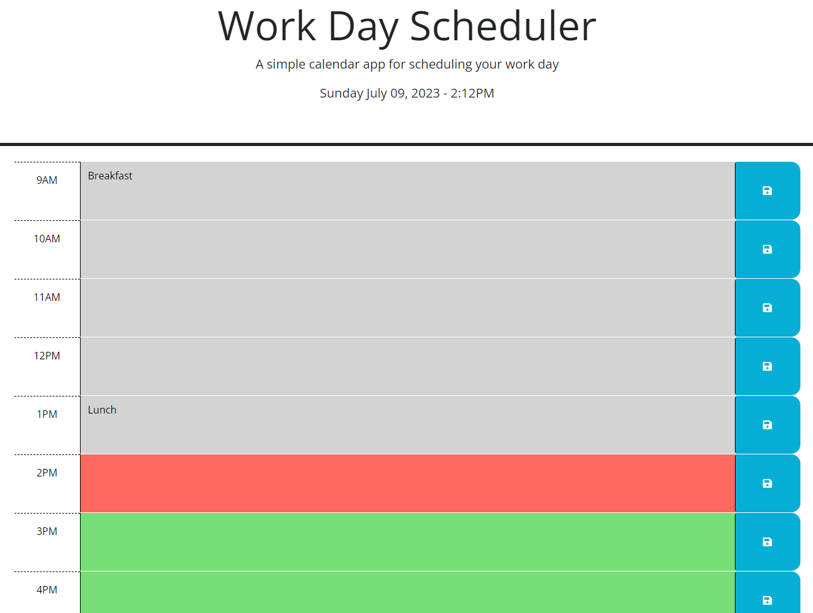

# **Calendar App**

This is a simple calendar app made in JavaScript.  It saves the text you type in each text area when you click the buttons, and it changes the color of each text area depending on whether the hour is in the past, present, or future.

- Uses a click listener to save the text content of the hour blocks into local storage when you click the save icons

- Retrieves the saved text from local storage and puts it back into the text areas on page load, so that calendar items persist through refreshes or page closes

- Loops through each hour block and applies a CSS class to them that changes their color, depending on how the listed hour compares against the current time

-

---
[Calendar App](https://ricadbur.github.io/calendar-app/)

---
Powered by [jQuery](https://jquery.com/) and [Day.js](https://day.js.org/)